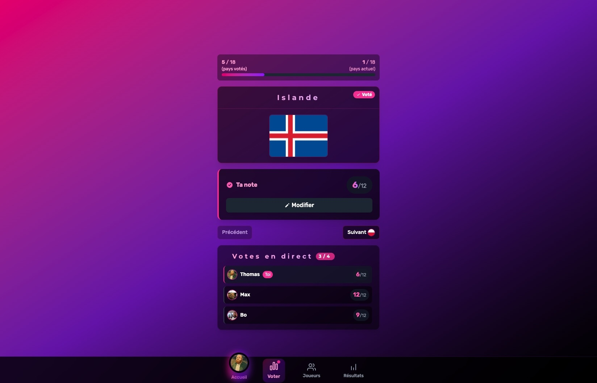
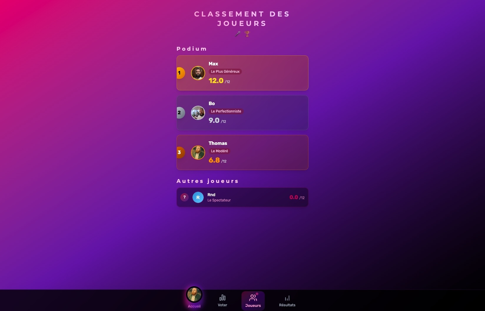
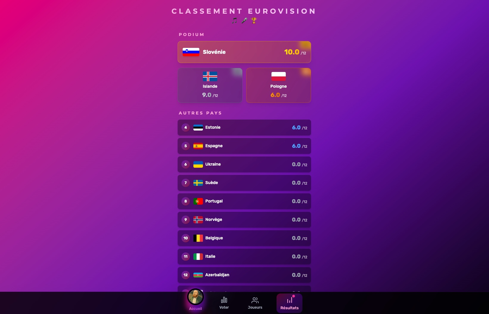
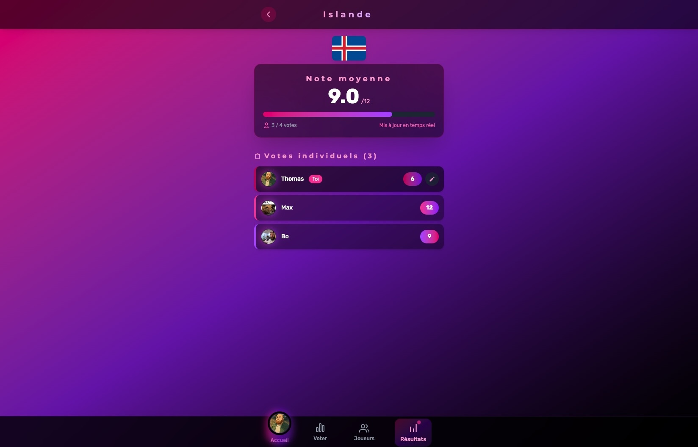

# Eurovision Voting App 🎶

[](#license)
[](https://vuejs.org/)
[](https://vitejs.dev/)
[](https://tailwindcss.com/)
[](https://firebase.google.com/)

A modern, real-time voting app for Eurovision events, built using **Vue 3**, **Vite**, **Firebase**, and **Tailwind CSS**.  
Perfect for sharing the Eurovision experience with friends and tracking live votes interactively!

---

## 🚀 Features

- 🎤 Real-time voting with Firebase.
- 📊 Instant display of average votes and standard deviation.
- 🌍 Country flags and ordered voting flow.
- 🎨 Fully responsive and mobile-friendly interface.
- 📝 User-friendly UI with vibrant Eurovision-themed design.
- 👥 Pseudo creation and optional avatar upload.
- 📱 PWA-ready structure for mobile app-like behavior.

---

## 📸 Screenshots

### 🏠 Home
<p align="left">
  
</p>

### 🎤 Voting Interface
<p align="left">
  
</p>

### 👥 Players Interface
<p align="left">
  
</p>

### 🏆 Results Overview
<p align="left">
  
</p>

### 🌍 Results Country
<p align="left">
  
</p>

---

## 📦 Project Structure

```
eurovision-app/
├── index.html
├── tailwind.config.js
├── postcss.config.mjs
├── vite.config.js
├── .env.dist
├── .env
├── package.json
├── public/
└── src/
    ├── assets/
    ├── components/
    ├── data/
    ├── store/
    └── views/
```

---

## 📚 Getting Started

### 1. Clone the Repository
```bash
git clone https://github.com/your-username/eurovision-app.git
cd eurovision-app
```

### 2. Install Dependencies
```bash
npm install
```

### 3. Configure Firebase  
Create a `.env` file based on `.env.dist`:

```env
VITE_FIREBASE_API_KEY=your_api_key
VITE_FIREBASE_AUTH_DOMAIN=your_auth_domain
VITE_FIREBASE_PROJECT_ID=your_project_id
VITE_FIREBASE_STORAGE_BUCKET=your_storage_bucket
VITE_FIREBASE_MESSAGING_SENDER_ID=your_messaging_sender_id
VITE_FIREBASE_APP_ID=your_app_id
```

### 4. Configure Countries
```
src/data/countries.js
```

### 5. Run the Application
```bash
npm run dev
```

---

## 📖 Usage

1. Create a pseudo and optionally upload an avatar.
2. Vote for each country as they appear.
3. See live results and rankings.
4. Access global results once all votes are submitted.

---

## 📅 Planned Features

- 🗳️ Private voting sessions with access codes.
- 📱 Full PWA support.
- 📈 Historical voting results storage.
- 🎉 Prediction games and quizzes.

---

## 📄 License

This project is licensed under the **Personal Non-Commercial Attribution License (PNCAL)**.

> You are free to:
> - Use and modify the material for personal and non-commercial purposes only.
> - Privately share the material with proper attribution.

**Under the following terms:**
- You **must credit Thomas CLOAREC** as the original creator in any use or modification.
- Commercial use is strictly prohibited for anyone other than Thomas CLOAREC.
- You may modify the project for personal use but are not allowed to sell, commercialize, or distribute it publicly without explicit permission.
- Public redistribution (including uploading modified versions to public repositories) requires prior written consent from Thomas CLOAREC.

For commercial licensing inquiries, contact: **thomas@cloarec.ca**

---

Made with ❤️ by **Thomas CLOAREC**.
